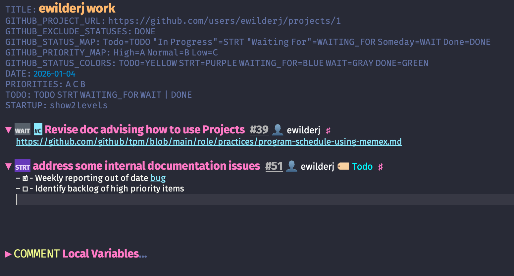

# project-to-org

View your GitHub Projects as Org-mode files with rich visual enhancements.

> ⚠️ **Note**: This is currently a **one-way sync** (GitHub → Org). Changes made in your Org file will be overwritten on the next sync. Use this tool for viewing and organizing your GitHub Projects in Emacs, not for editing them.

## What it Does

project-to-org fetches issues and draft issues from a GitHub Project V2 and converts them to an Org-mode file. The accompanying Emacs minor mode adds visual enhancements like status colors, compact URLs, and inline metadata badges.



(Screenshot notes: theme Dracula, with additional modes `mixed-pitch-mode`, `org-modern` and `org-tidy`)

## Features

### Data Sync
- **Issues & Draft Issues**: All items from your GitHub Project become Org headings
- **Status → TODO**: Project status maps to Org TODO keywords (e.g., "In Progress" → `STRT`)
- **Custom Fields**: Priority, dates, iteration, and other fields sync to `:PROPERTIES:` drawers
- **Assignees & Labels**: Stored as properties and displayed as inline badges

### Visual Enhancements (Emacs)
- **Status Colors**: TODO keywords are colored to match GitHub's status colors (GRAY, BLUE, GREEN, etc.)
- **Compact URLs**: Long GitHub URLs display as `owner/repo#123` (click to open, middle-click to copy)
- **Inline Badges**: Issue numbers, assignees, and labels appear as badges on each heading
- **Auto-fold Properties**: Properties drawers are automatically folded for cleaner viewing

## Requirements

- **Python 3.10+** with [uv](https://github.com/astral-sh/uv) for dependency management
- **GitHub CLI** (`gh`) authenticated with access to your project
- **Emacs 29.1+** for the visual enhancements (optional but recommended)

## Installation

### Step 1: Clone the Repository

```bash
git clone https://github.com/ewilderj/project-to-org.git
cd project-to-org
```

### Step 2: Set Up Emacs (Optional)

Choose one of these methods:

#### Using use-package with `:vc` (Emacs 29+)

```elisp
(use-package project-to-org
  :vc (:url "https://github.com/ewilderj/project-to-org"
       :rev :newest)
  :commands (project-to-org-sync project-to-org-mode)
  :custom
  (project-to-org-python-command "uv run"))
```

#### Using straight.el

```elisp
(use-package project-to-org
  :straight (:host github :repo "ewilderj/project-to-org")
  :commands (project-to-org-sync project-to-org-mode)
  :custom
  (project-to-org-python-command "uv run"))
```

#### Using quelpa

```elisp
(use-package project-to-org
  :quelpa (project-to-org :fetcher github :repo "ewilderj/project-to-org")
  :commands (project-to-org-sync project-to-org-mode)
  :custom
  (project-to-org-python-command "uv run"))
```

#### Manual Installation

```elisp
(add-to-list 'load-path "/path/to/project-to-org")
(require 'project-to-org)
(setq project-to-org-python-command "uv run")
```

## Quick Start

### 1. Create an Org file with the project URL

```org
#+GITHUB_PROJECT_URL: https://github.com/users/YOUR_USERNAME/projects/1
```

You can find your project URL by opening your GitHub Project in a browser and copying the URL.

### 2. Sync from Emacs

Open the Org file and run:

```
M-x project-to-org-sync
```

The file will be populated with your project's issues. The minor mode (`project-to-org-mode`) enables automatically via file-local variables added by the sync.

### Alternative: Sync from Command Line

```bash
uv run project_to_org.py \
  --project-url https://github.com/users/YOUR_USERNAME/projects/1 \
  --org-file my-project.org
```

## Configuration

### Emacs Customization

All settings are in the `project-to-org` customization group (`M-x customize-group RET project-to-org`).

| Variable | Default | Description |
|----------|---------|-------------|
| `project-to-org-python-command` | `"uv run"` | Command to run Python scripts |
| `project-to-org-script-path` | `"project_to_org.py"` | Script path (relative or absolute) |
| `project-to-org-compact-urls` | `t` | Show URLs as `owner/repo#123` |
| `project-to-org-inline-metadata` | `t` | Show badges on headings |
| `project-to-org-fold-properties` | `t` | Auto-fold properties drawers |
| `project-to-org-issue-prefix` | `"#"` | Prefix for issue badges |
| `project-to-org-assignee-prefix` | `"👤 "` | Prefix for assignee badges |
| `project-to-org-label-prefix` | `"🏷️ "` | Prefix for label badges |

If `project-to-org-script-path` is a relative path (the default), it searches standard locations (package directory, straight.el repos, quelpa packages). If set to an absolute path, it uses that directly. Prefix for issue badges |
| `project-to-org-assignee-prefix` | `"👤 "` | Prefix for assignee badges |
| `project-to-org-label-prefix` | `"🏷️ "` | Prefix for label badges |

### CLI Options

```
--project-url URL          GitHub Project URL (required)
--org-file FILE            Output file path
--exclude-statuses STATUS  Exclude items with these statuses
--status-map MAP           Custom status→TODO mapping (e.g., 'Todo=TODO "In Progress"=STRT')
--priority-map MAP         Custom priority→Org mapping (e.g., 'Low=C Medium=B High=A')
--no-local-variables       Don't add Local Variables block (disables auto-enabling the mode)
```

### Custom Status Mapping

By default, statuses map to: `Todo` → `TODO`, `In Progress` → `STRT`, `Done` → `DONE`.

To customize:

```bash
uv run project_to_org.py \
  --project-url ... \
  --status-map 'Backlog=WAIT Todo=TODO "In Progress"=STRT Done=DONE'
```

### Priority Mapping

GitHub Project priorities are mapped to Org priority cookies (`[#A]`, `[#B]`, etc.). The tool auto-detects common schemes:

| GitHub Priority | Org Priority |
|-----------------|-------------|
| `P0` | `[#A]` |
| `P1` | `[#B]` |
| `P2` | `[#C]` |
| `High` / `Critical` / `Urgent` | `[#A]` |
| `Medium` / `Normal` | `[#B]` |
| `Low` | `[#C]` |

For custom priority fields, use `--priority-map`:

```bash
uv run project_to_org.py \
  --project-url ... \
  --priority-map 'Critical=A Important=B Normal=C'
```

## How It Works

1. The standalone Python script (`project_to_org.py`) has inline dependencies and runs via `uv run`
2. It queries GitHub's GraphQL API via the `gh` CLI for authentication
3. Issues and draft issues are converted to Org headings with properties
4. Status colors are stored in `#+GITHUB_STATUS_COLORS` for the Emacs mode
5. The Emacs mode applies overlays for colors, compact URLs, and badges
6. Overlays refresh automatically when the file is saved

## Limitations

- **One-way sync only**: GitHub → Org. Local changes will be lost on re-sync.
- **No write-back**: Editing TODO states in Org does not update GitHub.
- **100 item limit**: Currently fetches the first 100 items from a project (pagination not yet implemented).

## License

MIT
